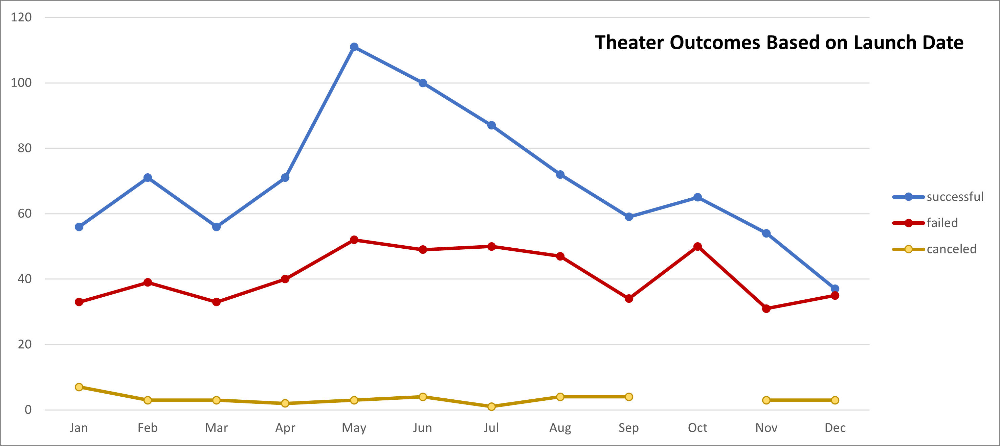

# Overview of the Project
The purpose of this project was to summarize campaign data and identify trends related to theater and play outcomes.  Visualizations were used to present theater results based on launch dates over a period of time.  Finally, we filtered the campaigns to understand how funding goals were related to the outcome of plays.

# Analysis and Challenges

Analysis was done by creating two separate visuals, a pivot table, and series of formulas based on the kickstarter dataset.

*Theater Outcomes Based on Launch Date*
 
 

 The challenge with *Outcomes vs Launch* is difficulty analyzing how total campaigns may or may not impact the outcome.  The above graph illustrates a declining trend in success in later months; however, a correlation between total number of campaigns and success rate could debate the launch date is not as relevant.

# Results

## Conclusions about Theater Outcomes by Launch Date

Successful theater campaigns was the first conclusion made about theater outcomes.  The line chart shows successful theater campaigns are much higher during spring months compared to the rest of the year.  The total number of theater campaigns is also higher in summer months.

The second observation includes the failed and canceled campaigns.  Despite the time period and total number of campaigns in a month, the canceled and failed numbers remain relatively constant.

## Conclusion about the Outcomes based on Goals

There is no consistent relationship between success rates and amount of campaign funding goals for plays.  For goals ranging from zero (0) to thirty thousand (30,000), as the goal amount increases the percentage of success decreases. The exception to this trend is campaigns with funding goals between thirty-five thousand (35,000) and forty-five thousand (45,000).

## Limitations and Recommendations

The first limitation of the dataset is currency.  Outcome analysis is performed on dollar ranges despite different currencies included in the dataset (USD, GBP, EUR, etc.).  This could negatively impact the perceived trends.

Another limitation is the relationship between campaign content and culture.  Culture could play a major role in how campaigns are received and therefore funded.  Different cultures may prefer different genres (campaign content).

There are a couple other graphs that could prove to be valuable.

- The number of backers and compared to goal and how that impacts the success rate of campaign goals.
- The amount of time elapsed between campaign start and launch and how that duration impacts success or failure.
- Use a bar graph and add total number of campaigns per month; this would potentially show a relationship between the total number of campaigns and success rate.